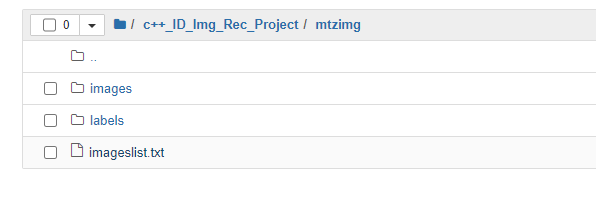
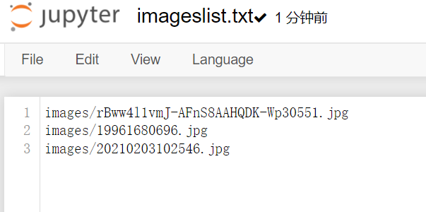
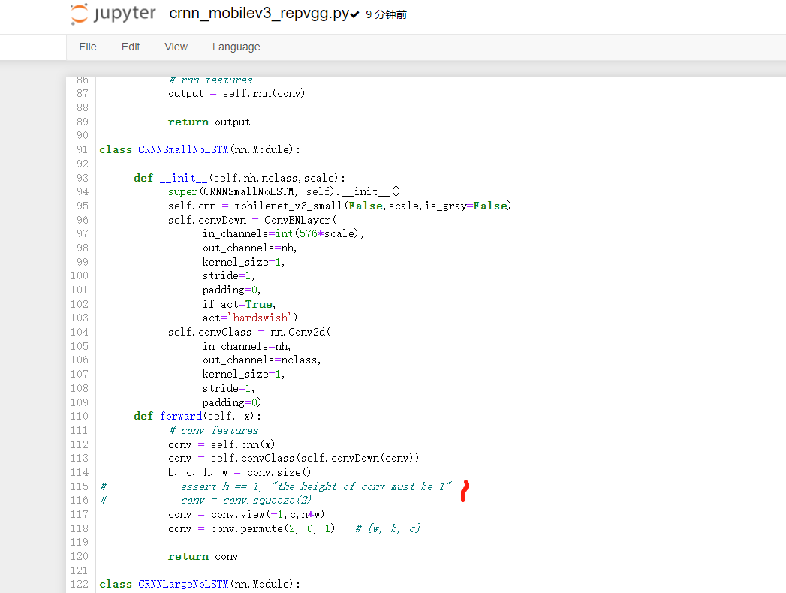

# MDAI-Model-Deployment-And-Inference-
## 项目架构  
1. build:编译后的可执行文件  
* Reminds:在cmakeLists.txt里面添加要编译的文件，然后再build里面cmake ..生成编译文件，然后再make得到可执行文件  
    每修改代码，就需要重新在build下make编译一下，重新生成可执行文件  
    
        

********************

2. Include  
        -Crnn:  
           >Crnn.h:提供一个文字识别器类，其构造函数用于初始化ncnn::Net crnn，加载model.param和model.bin, 还有一个成员函数detect_crnn用于推理。
           >Utils_crnn.h:提供crnn推理中需要用到的工具函数 
        -DBNet:  
           >DBnet.h: 提供了一个文字检测器类，其构造函数用于初始化ncnn::Net dbnet,加载model.param和model.bin,还有一个成员函数detect_text用于推理。  
           >Utils_dbnet.h:提供了dbnet推理中需要用到的后处理函数
        -ModelService:  
           >ModelService.h: 提供一个modelservice构造函数,通过类的组合，添加Crnn、DBnet、Yolov5的类定义的对象作为成员变量（这样的好处就是需要用到其他算法时只要添加相应的类的对象作为成员即可）
        -Utils:  
           >Tools.h：里面提供的是串联整个项目所需要的工具函数，比如抠图、透视变换、画图、识别后对文本修正的后处理等。  
        -Yolov5:  
          >Utils_yolo.h：提供yolov5推理中需要用到的工具函数，比如生成候选框、排序、nms、IOU计算等。  
          >Yolov5.h: 提供一个目标检测器类，其构造函数用于初始化ncnn::Net yolov5，加载model.param和model.bin, 还有一个成员函数detect用于推理。
**************
        
3. Src:Include中每一个.h所对应的.cpp源文件
********

4. Output:保存中间结果

********

5. CMakeLists.txt:编译文件，自定义了函数ncnn_add_example，加载opencv、加载ncnn、加载所有源文件src、生成可执行文件并link到opencv和ncnn、include相关的头文件目录

********

6. main_crnn.cpp :用于测试crnn推理
********

7. main_dbnet.cpp :用于测试dbnet推理
********

8. main_yolo.cpp :用于测试yolo推理,yolov5中的focus自定义添加到ncnn中编译。
********

9. main_modelservice.cpp:用于身份证识别，串联了yolo模型和crnn模型  
********

10. mtzimg :用于存放int8量化所需要的校验集，这里以mtz检测业务为例  
********

11. font ：用于画图bbox时标记上中文，使用的中文字体
********

12. ncnn-20220420: ncnn框架，需要先编译，mkdir build、cd build、cmake ..、make、make install ;Remind：因为要将编写的c++推理文件link上ncnn，所以要make install得到lib文件夹  
Remind:在编译ncnn时需要先安装protobuf和opencv4.5  
**********  
13. onnx2ncnn_model：存放onnx转成ncnn模型，包括ncnn的fp16量化、int8量化 
*********  
            
14. torch_onnx：  
         -onnx_models:存放onnx模型  
         -yolo_export:yolo算法torch转onnx的通用代码，以及使用onnxruntime推理onnx模型的代码  
         -onnx_test_output:存放onnxruntime推理的结果图像
***************  

15. requirement.txt: 环境配置相关系数  
## 2022.8.14  更新yolov5 torch转onnx  
涉及算法yolov5、dbnet、crnn  
2022/8/16  
torch_onnx ：添加了yolo_export: export和test_yolov5s_onnx.ipynb适用于所有yolo系列   
onnx_models：yolov5存放相关的onnx模型  
onnx_test_output: 存放onnx模型推理的结果  

Remind:注意使用onnxruntime推理onnx模型时，动态输入输出和静态输入输出的区别，以yolo为列，动态输出仅仅使用于输出为三个feature maps时，如果想要使用--grid cat三个尺寸是不可以的，并且在动态输入输出时不支持onnxsimplify简化模型op；在静态输出时既可以是三个输出也可以是--grid合并的一个输出，并且也可以使用onnxsimplify  
Tips:在部署可以跟据部署方案来选择onnx的输入方式，比如使用onnxruntime时的动态输入和静态输入的差别，而在使用ncnn部署移动端模型时，由于ncnn本身就是支持动态输入的与onnx输入无关，所以可以统一使用静态onnx，然后sim后再转成ncnn，需要注意在ncnn的输出node需要使用-1替代完成动态输出  
注意：onnxruntime推理的时候输入输出都是数组numpy_array，不是tensor
## 2022.8.17 更新yolov5 onnx转ncnn
yolov5中的focus层在onnx中无法直接转换成ncnn模型，  
所以在src/layer中自定义了yolov5focus.h和yolov5focus.cpp  
之后需要在ncnn/src/CMakeList.txt中使用ncnn_add_layer(YoloV5Focus)添加想要集成到ncnn的layers，然后再重新编译ncnn    

使用./onnx2ncnn将onnx模型转换成ncnn,运行onnx2ncnn，举例：

cd ncnn-20220420/build/tools/onnx ./onnx2ncnn best-lite.onnx best-lite.param best-lite.bin
**********************
使用./ncnnoptimize优化网络结构，合并网络的层，减少cudnn调用相关算子API的次数，从而加速模型的推理,举例：  
这里的0表示的就是不使用其他精度量化即保持fp32，下面的65536表示的是2^16 = 65536，所以是2的十六进制的数。

ncnn fp32 加速优化 cd ncnn-20220420/build/tools ./ncnnoptimize best-lite.param best-lite.bin best-lite_fp32.param best-lite_fp32.bin 0  
ncnn fp16量化 cd ncnn-20220420/build/tools ./ncnnoptimize best-lite.param best-lite.bin best-lite_fp16.param best-lite_fp16.bin 65536
**********************

## 2022.8.18 int8量化     
int8的量化ncnn和tensorrt的算法原理一致，都是线性对称量化  
需要准备：1000+的校准集（从训练集中随机抽取），需要准备这1000+张图片的路径+文件名放在一个imagelist.txt中，这里放个四五张为例如下：  

******************************

ncnn int8量化步骤：  
cd ncnn-20220420/build/tools ./ncnnoptimize best-lite.param best-lite.bin best-lite_fp32.param best-lite_fp32.bin 0   
准备相关校验（论文说1000+左右数据，从训练集中抽取）  
**step1**.find images/ -type f > imagelist.txt  可以使用该命令获取相关imagelist  
**step2**.cd ncnn-20220420/build/tools/quantize  ./ncnn2table best-lite_fp32.param best-lite_fp32.bin  /src/notebooks/IDimg/imagelist.txt  best-lite-mtz.table mean=[0,0,0] norm=[1/255.0,0.0039215,0.0039215] shape=[640,640,3],pixel=BGR thread=8 method=aciq  
**在制作int8table时注意 归一化的系数要和训练保持一致，shape保持一致，method提供的是量化的方法常用的是kl和aciq**  
*********************************************
Remind:yolov5的focus层使用kl量化方法时精度损失较为严重，所以对于yolo采用aciq量化算法  
**step3**.再使用 ./ncnn2int8 best-lite_fp32.param best-lite_fp32.bin best-lite_int8.param best-lite_int8.bin best-lite-mtz.table

Remind:在进行int8模型推理时，需要设置ncnn::Net yolov5该网络的推理模式，比如yolov5.opt.num_thread=8,yolov5.opt.use_int8_inference=true 
## 2022.8.19 更新crnn算法
### crnn torch转onnx、onnx转ncnn    
### **1.crnn torch转onnx**  ###
**crnn**的torch转onnx注意要将backbone中的assert去除，以及squeeze层，使用view层来代替。（onnx不支持assert和squeeze），如下图：  
  
     见torch_onnx->crnn_export:export_crnn.py  
     
**********************************
### **2.crnn onnx转ncnn** ###
ncnn对F.relu6的支持不稳定，在转换ncnn模型的时候会出现.core溢出问题，所以在转onnx建议也将backbone里面的hswish的  

out = x * F.relu6(x + 3, inplace=True)/6
  

改写成 out=x*torch.clamp(x+3,0,6) /6
  

  
Remind:ncnn本身就是支持动态输入的，如果希望ncnn模型支持动态输出，将最后输出层的reshape70改成-1

### onnxruntime推理crnn_onnx模型、crnn的ncnn fp16量化，int8量化
**1.1 crnn onnx模型onnxruntime推理** torch_onnx->crnn_export:test_crnn_onnx.ipynb  
**2.1 crnn ncnn fp16量化**，按照2中的修改相关算子后，使用下面的onnx2ncnn.sh将onnx模型转换成ncnn模型，接着再使用ncnnoptimize_fp.sh对模型结构进行合并优化，并且进行fp16量化。  
**2.2 crnn ncnn int8量化**，基本流程与yolov5 int8量化一致，除了归一化的参数调整mean:[127.5,127.5,127.5],norm:[1/127.5,1/127.5,1/127.5]
## 2022.8.19 更新onnx2ncnn文件夹，添加了onnx2ncnn.sh  更新ncnnoptimize_fp16.sh
## 2022.8.22 更新int8量化相关ncnnoptimize_fp32.sh、ncnn2table.sh、ncnn2int8.sh
******************************
## 2022.8.22 更新dbnet算法
### crnn torch转onnx、onnx转ncnn    
**1.dbnet torch转onnx**  
     见torch_onnx->dbnet_export:export_dbnet.py  
**********************************
**2.dbnet onnx转ncnn**  
*********************************

### onnxruntime推理dbnet_onnx模型、dbnet的ncnn fp16量化，int8量化
**1.1 dbnet onnx模型onnxruntime推理** torch_onnx->dbnet_export:test_dbnet_onnx.ipynb   
**2.1 dbnet ncnn fp16量化**,使用onnx2ncnn中的onnx2ncnn.sh将onnx模型转换成ncnn模型，接着再使用ncnnoptimize_fp.sh对模型结构进行合并优化，并且进行fp16量化。  
**2.2 dbnet ncnn int8量化**，基本流程与yolov5 int8量化一致
## 2022.8.23实现了一个通用版的export_torch2onnx  
由于在加载torch模型的时候，有两种方案：  
 **1.保存整个模型**
torch.save(net,"xxxx.pt"),  
        torch.load("xxxx.pt");
 
    
****************************    

**2.保存模型的参数**
torch.save(net.state_dict(),"xxxx.pt"),  
        model_dict=torch.load("xxxx.pt",device),  
        Model m=model(),m.load_state_dict(model_dict);
                                          
  
官方推荐的是第二种方式，保存模型的权重，然后new class一个新模型对象，再去加载权重，这种方式在模型移动或者外部调模型时，能够直观的发现文件的层级关系，通过sys.path.append("xxxxx")来添加项目路径，再用import相关模块，这样一来都需要一定程度修改export部分的代码，或者每一个模型单独自己的export，像我这里提供的一样。  
Tips:所以添加了一种基于第一种save、load模型的方式，第一种方式是保存模型，这种方式会同时保存路径封装对象，所以只要torch.load("xxxxxxxx.pt")就行，不用再添加路径，声明对象，但是还是要上传相关的模型文件比如models，并且路径不能再修改，否则保存的.pt是按照先前的路径的，会出现线索不到模块的问题。  
### 2022.8.24 添加配置文件，给予出项目路径和torch权重路径即可，通过torch_onnx/export_torch2onnx.py即可得到onnx模型  
设置：weight_path、file_onnx、input_img_size、simplify、dynamic
### 2022.8.26 优化了项目结构的代码（新增了父类Net_Creator.h，以及虚方法detect）
1.抽象出来了一个Net_Creator.h父类，子类Crnn2.h继承父类后只要实现其detect方法即可，目前在crnn模块已经测试通过，可见main_virtual_crnn.cpp  
2.子类yolov5_virtual.h继承父类后实现detect即可，目前yolov5模块也测试通过，见main_virtual_yolov5.cpp  
Remind:Utils_yolo.h中的#include "Yolov5.h"需要注释，并且添加"Net_Creator.h"，因为在"Net_Creator.h"中声明了Object结构体，如果Yolov5.h不注释会发生重复定义，如果不要使用这个优化的版本，那就将"Net_Creator.h"注释即可。  
3.并且对于每个模型的detect方法做了虚函数处理，后续封装一个net_detect()方法，通过传入模型类型指针来分别调用其推理函数  
见Include/Utils/Net_Detect.h中的Net_detect，实现了函数的重载提供了crnn和yolo两种不同输入参数的推理，通过Net_detect的override去调不同输入类型的函数。  
4.添加了ModelService_virtual.h通过类的指针对象初始化一系列项目需要的网络，推理函数见main_modelservice_virtual.cpp

#### Tips:通过这一部分学习了有关于虚函数的使用（父类中的定义、重载、子类中的定义）  
### 2022.8.30 添加了model_service_opt_config.txt 配置文件，  
0.在ModelService_virtual.h中添加了config_opt结构体  
1.main_modelservice_virtual.cpp中初始化modelService对象时需要读取txt文件。添加了读取txt文件后，并且编写函数string2vetcor将每一行string根据子串“ ”转换成vector  
2.重载了ModelService_virtual.h中ModelService的构造函数。支持输入为配置文件的vector
### 2022.8.26更新main_dbnet.cpp，以及相关的Include/DBNet/DBNet.h，Utils_dbnet.h以及Src中相关的源文件的实现(未完成)
### 2022.8.31 NCNN模型结果比对onnx模型（涉及onnx输出中间层结果、NCNN输出中间结果） 
在Include、Src中添加ncnn_modelvis的可视化方法  
1.ncnn:逐层对比NCNN与onnx模型的输出结果，使用onnxruntime(python)和NCNN(c++)分别提取出每个节点的输出，进行对比
ncnn:extractor.extract(node_name,preds)  
2.onnx没有提供中间层输出的方式
参考在torch_onnx/yolo_export中test_yolov5s_onnx.ipynb中的自定义函数find_node_by_name
## 2022.9.12 NCNN使用GPU加速推理
与int8模型推理一样，使用ncnn中调用vulkan的API即可  
net.opt.use_vulkan_compute = true;
